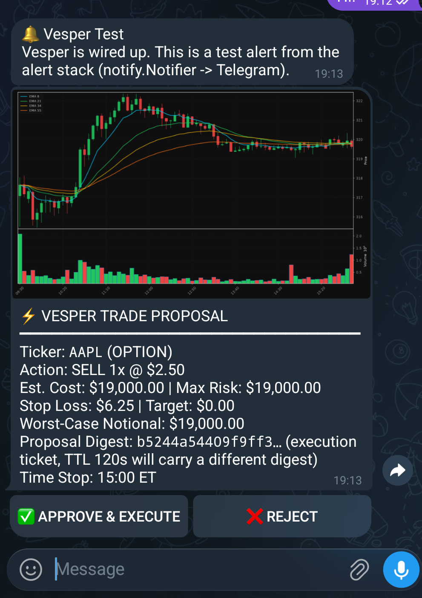

# Vesper

A LangGraph-based autonomous trading agent for **Webull**. Vesper scans for
setups, analyses them against TraderDaddy Pro dealer-gamma structure, drafts an
order, runs it through a deterministic risk gate, asks a human for approval
over **Telegram or Discord**, executes, and then monitors the open position for
an exit.

It is a **single-operator personal tool**, not a hosted product. There is no
authentication, no multi-tenancy, and no browser UI or HTTP API — everything
runs as a local CLI plus two outbound-only bot connections. See
[CLAUDE.md](CLAUDE.md) for the full design rules; this file is the "how do I
run it" version.

**This app can place real orders.** The kill switch defaults **off**
(`VESPER_TRADING`, unset or `0` = no order reaches the broker), and every
proposal still has to clear a deterministic risk gate and a human tap on an
approval card before it does.

## Run

```bash
./.venv/bin/python vesper.py scan             # scan for setups (VCP, squeeze, institutional flow, ...)
./.venv/bin/python vesper.py analyze NVDA     # deep technical + options audit for one ticker
./.venv/bin/python vesper.py 0dte             # SPY/QQQ 0DTE gamma-flip decision support
./.venv/bin/python vesper.py morning          # morning briefing
./.venv/bin/python vesper.py monitor          # one exit-cascade sweep over open positions
./.venv/bin/python vesper.py status           # halt state, circuit breaker, trading on/off
./.venv/bin/python vesper.py paper            # paper-trading ledger

./.venv/bin/python vesper.py listen           # long-poll Telegram for Approve/Reject/halt/resume taps
./.venv/bin/python vesper.py loop             # unattended: scheduled scans + continuous monitor + alert watcher
./.venv/bin/python vesper.py loop --live      # same, but drafts pause for remote approval — run `listen` too

./.venv/bin/python vesper.py alerts --arm SPY flip below   # arm a dealer-gamma alert
./.venv/bin/python vesper.py halt / resume                 # emergency freeze / release
```

`vesper.py --help` lists every command and flag. Nothing places an order
without `VESPER_TRADING=1` **and** an approval tap — `--live` only unlocks the
*attempt*, it does not skip the gate.

### Credentials

Two places, both gitignored:

| File | Contents |
| --- | --- |
| `./.env` (repo root) | `WEBULL_APP_KEY`, `WEBULL_APP_SECRET`, `WEBULL_REGION_ID`, `WEBULL_ENVIRONMENT` (or `WEBULL_KEY`/`WEBULL_SECRET`); `TD_API_KEY`/`TDPRO_API_KEY`; `TELEGRAM_BOT_TOKEN` + `TELEGRAM_CHAT_ID` + `TELEGRAM_AUTHORIZED_USER_IDS`; `DISCORD_BOT_TOKEN` + `DISCORD_CHANNEL_ID` + `DISCORD_AUTHORIZED_USER_IDS`; `OPENROUTER_API_KEY` (optional — narrative + risk audit only, see below) |
| `../.env.*` (one directory up) | the original per-service convention (`.env.notify`, `.env.telegram`, ...) — `notify.py` still reads both this and `./.env`, so either layout works |

`vesper.py` calls `load_dotenv()` on `./.env` at startup, which is why every
module can read straight from `os.environ`. An `export` in your shell does
**not** reach a systemd service — it needs its own env file.

Audit `git diff --cached` for `sk-ant-`, `td_live_`, or a bot token before any
push.

### Getting started on a new machine

```bash
git clone <this repo>
cd webull-sidecar
python3 -m venv .venv                              # 3.8-3.14 all fine on webull SDK 2.0.16
./.venv/bin/pip install -r requirements.txt

cp .env.example .env                                # then fill in real values
vi .env

./.venv/bin/python vesper.py status                 # confirms Webull + TDPro connectivity
```

### Key environment variables

| Variable | Default | Purpose |
| --- | --- | --- |
| `VESPER_TRADING` | off | The kill switch. Must be explicitly set truthy for any order to reach the broker. |
| `VESPER_MAX_NOTIONAL` | `2500` | Max $ per order, checked server-side on every path (a SELL-to-open option is sized off strike, not premium). |
| `VESPER_MAX_QUANTITY` | — | Max shares/contracts per order. |
| `VESPER_MAX_BP_FRACTION` | — | Cap an order at this fraction of buying power. |
| `VESPER_SYMBOL_ALLOWLIST` | — | Comma-separated. Empty means any symbol. |
| `VESPER_CIRCUIT_BREAKER_PCT` | 15% | Trailing-peak NLV drawdown that trips the emergency halt automatically. |
| `OPENROUTER_MODEL` | — | Model used for thesis narrative + risk red-team (rule 6 in CLAUDE.md — narrate/reject only, never originate or upsize). |

## Layout

```
vesper.py          CLI entrypoint: scan / analyze / 0dte / morning / monitor /
                    loop / listen / alerts / halt / resume / status / paper / audit
vesper/
  graph.py          LangGraph pipeline + disk-backed SQLite checkpointer
  runner.py         Drives one agent session
  loop.py           Unattended daemon: scheduled scans + monitor + alert watcher
  state.py          Pydantic models (OrderProposal, OrderLeg, TradingState, ...)
  execution_guard.py  THE ORDER PATH — the only module that can move money
  risk.py           RiskEnforcer: sizing + capital-allocation buckets
  circuit_breaker.py  Trailing-peak NLV drawdown -> automatic halt
  halt.py           Emergency freeze, checked before anything else
  monitor.py        Position monitor + exit cascade
  llm.py            OpenRouter: thesis narrative + risk red-team, narrate/reject only
  nodes/            regime, scanner, analyst, playbooks, risk_gate, human_gate, executor, reflection
  bot/              Telegram + Discord approval adapters, channel manager
  brokers/          public_broker.py (second, partial adapter)

wb.py               Webull client — credentials, account/order reads, the scarce 2-req/2s bucket
md.py               Market data, research, screeners (separate 600/min bucket — don't merge with wb.py)
td.py               TraderDaddy Pro client + dealer-gamma compaction (td.levels())
alerts.py           Alert store + crossing logic (a level can BE dealer structure)
watcher.py          Background thread evaluating alerts
notify.py           Alert delivery: ntfy and/or Telegram
stream.py           MQTT quote push + gRPC trade-event push, wakes the monitor on a fill
mcp_server/         Quant tooling exposed over MCP (FastMCP, stdio) — screeners, backtests, options analytics
tests/              pytest, hermetic — Webull and Agent SDKs stubbed in conftest
deploy/             systemd unit + Tailscale-gated installer — STALE, see below
docs/               API/design docs, vendored Webull OpenAPI reference
ROADMAP.md          Single planning doc: status, known gaps, ideas backlog
```

There is no `server.py`, no browser UI, and no HTTP API — an earlier version
of this repo had those, and they were deliberately removed rather than kept
around unused. `mcp_server/` is a separate thing: it exposes quant tooling
(screeners, technicals, backtests) to MCP hosts, not a bridge to the broker —
it holds no credentials and cannot place an order.

## Connecting an MCP host (Claude Desktop, Claude Code, Codex, ...)

`mcp_server/` is a real MCP server — 52 read-only tools (screeners, technical
indicators, options/VoPR analytics, macro & breadth detectors, TraderDaddy
intel, backtesting, a knowledge-base search) — and it talks stdio by default,
so any MCP-compatible host can spawn it as a subprocess. It reads the same
`./.env` as everything else; most tools need no extra key at all (yfinance,
TradingView), a few want `TRADERDADDY_API_URL`/`_EMAIL`/`_PASSWORD` or
`OPENROUTER_API_KEY`/`GEMINI_API_KEY`. It is safe to hand to any of these —
it never touches `vesper/execution_guard.py` and cannot place an order.

**Claude Desktop** — Settings → Developer → Edit Config:

```json
{
  "mcpServers": {
    "momentum": {
      "command": "/path/to/webull-sidecar/.venv/bin/python",
      "args": ["-m", "mcp_server.server"],
      "cwd": "/path/to/webull-sidecar"
    }
  }
}
```

**Claude Code** — from the repo root:

```bash
claude mcp add momentum --scope project -- /path/to/webull-sidecar/.venv/bin/python -m mcp_server.server
```

`--scope project` writes it to a `.mcp.json` at the repo root. That file isn't
gitignored here, so either commit it (absolute paths won't match a
collaborator's clone, so they'd need `--scope local` instead) or leave it
uncommitted and let each person run the command for themselves.

**Codex CLI** — in `~/.codex/config.toml`:

```toml
[mcp_servers.momentum]
command = "/path/to/webull-sidecar/.venv/bin/python"
args = ["-m", "mcp_server.server"]
```

`MCP_TRANSPORT=sse` is also supported (`mcp_server/server.py` will bind
`MCP_HOST`/`MCP_PORT` instead of stdio) for a host that needs a remote
connection rather than a local subprocess — nothing in this repo starts it
that way by default, and the code's allowed-hosts list is hardcoded to one
specific domain, so treat SSE mode as something to adapt, not use as-is.

## Skills

The repo ships 64 Claude Code skills under `skills/` — project-scoped, so
they're picked up automatically by any Claude Code session opened in this
directory, no registration step needed. A sample of what's in there:

| Skill | What it does |
| --- | --- |
| `stock-recap` | Runs every screener, pulls the biggest options flow and 13F activity, finds the names multiple independent sources agree on |
| `vcp-screener` / `canslim-screener` | Minervini VCP and O'Neil CANSLIM growth-stock screens |
| `momentum-squeeze` | Coiled-volatility scan → confirmed-uptrend pullback entries |
| `0dte-flow` | Same-day XSP/SPX decision support with hard risk guardrails |
| `market-breadth-analyzer` / `market-top-detector` / `ftd-detector` | Breadth health, distribution-day risk, follow-through-day bottom confirmation |
| `macro-regime-detector` | Cross-asset regime shifts (concentration, broadening, contraction, inflationary) |
| `institutional-flow-tracker` / `sector-analyst` / `theme-detector` | 13F flow, sector rotation, thematic lifecycle |
| `options-strategy-advisor` | Black-Scholes pricing, Greeks, strategy P/L simulation |
| `backtest-expert` | Parameter robustness, slippage modeling, bias prevention for strategy validation |
| `edge-*` (7 skills) | A full pipeline from raw observation → hint → concept → strategy draft → adversarial review → export |
| `kanchi-dividend-*` (3 skills) | Dividend-growth screening, forced-review triggers, US tax/account-placement rules |
| `breakout-trade-planner` / `position-sizer` | Entry/stop/target levels and portfolio-heat-aware sizing |

Every skill has its own `SKILL.md` describing what it's for and when to use
it — that's the full, current list; this table is a sample, not an index.
Invoke one by name (`/vcp-screener`, `/stock-recap`, ...) or just describe
what you want and Claude picks the matching skill.

## Tests

```bash
pip install -r requirements-dev.txt && pytest -q
```

Hermetic — no network, no broker, no credentials. The Webull SDK and Agent SDK
are stubbed in `tests/conftest.py` (one needs a compiler and pins the Python
version, the other shells out to an npm-only binary), so
`requirements-dev.txt` is deliberately **not** a superset of
`requirements.txt`. An autouse fixture redirects every on-disk state file
(halt, circuit breaker, paper ledger, approval registry, graph checkpoints) to
a temp dir, so a test run cannot touch real state or your account.

CI (`.github/workflows/ci.yml`) runs the suite on Python 3.10 and 3.14, plus a
`compileall` pass and a credential-shaped-string scan, on every push and PR.

## The order path

`vesper/execution_guard.py` is the only module allowed to write to the broker.
**Preview, then confirm, then place**: `preview()` runs the guards and stages a
ticket carrying a SHA-256 of the exact payload; `place()` takes a `ticket_id`,
never a raw order, so what was approved is byte-for-byte what reaches Webull.
Tickets are single-use and expire in 120 seconds. Approval happens on a
Telegram or Discord card, not a spoken or typed command — see CLAUDE.md rule
4d for why voice specifically never confirms an order.



*A test proposal — the chart, digest, and Approve/Reject buttons are real; the
numbers are not a live account.*

**Not exercised against a live account yet.** The order path is tested end to
end against a stub broker, which proves the wiring, not Webull's acceptance of
it. See the Status section of [CLAUDE.md](CLAUDE.md) for exactly what has and
hasn't been verified live.

## Deploy

`deploy/` describes a systemd **user** service, Tailscale-gated (never bind to
`0.0.0.0` — this app has no authentication and holds live brokerage
credentials). **It is stale**: it still assumes the pre-migration
`run.sh`/port-8787 layout from before this became a CLI-driven agent. Nothing
redeploys automatically today; re-verify `deploy/install.sh` and
`deploy/sidecar.service` before trusting them against a running instance.

## More detail

[CLAUDE.md](CLAUDE.md) has the full picture: the critical design rules (order
path, kill switch, LLM narrate/reject-only boundary, push-vs-poll for the
monitor, dealer-gamma alert semantics, voice-over-Telegram design), the
rate-limit gotchas, and the current verified/unverified status of each
subsystem.
