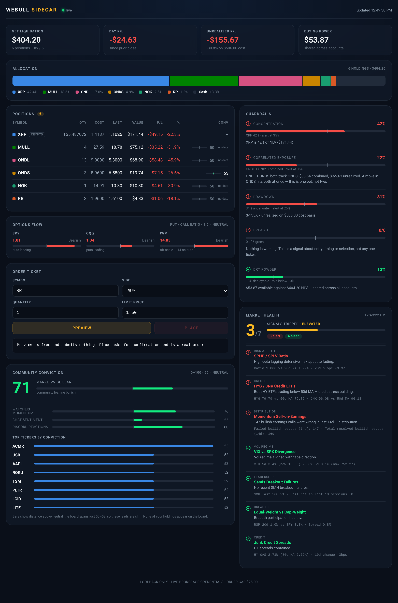

# sidecar

A companion deck for Webull Desktop. Live positions, P&L, portfolio guardrails,
TraderDaddy Pro signals, and a Claude chat panel — in a browser window you park
*beside* the Webull app. **Read-only: sidecar cannot place, modify, or cancel
an order.** It only ever reads your account; all trading still happens in
Webull Desktop itself.



*Portfolio, guardrails, options flow, and conviction figures above are
illustrative sample data, not a real account.*

## Why "sidecar" and not an overlay

A floating always-on-top overlay **cannot work on ChromeOS Crostini**. Linux apps
run in an LXC container; Sommelier proxies each window out to ChromeOS's own
compositor, where every Linux window becomes an ordinary ChromeOS window.
ChromeOS owns stacking and won't honour a container app's always-on-top request.
Xwayland here is `-rootless`, so there's no root window to draw on and the usual
X11 overlay tricks (override-redirect, XShape click-through) have nothing to bite
on. Webull Desktop is also Qt5 + QtWebEngine — no Electron `.asar`, no JS to
inject, no devtools port — so modifying its UI would mean binary patching, which
is fragile across upgrades and against Webull's ToS.

So sidecar sits *next to* Webull instead, reading the same account over the
OpenAPI. Nothing it shows depends on the desktop app running at all.

## Run

```bash
./run.sh                 # http://127.0.0.1:8787
```

**Loopback only by default, and that default is load-bearing.** This process
holds live brokerage credentials, with **no authentication of any kind**.
sidecar is read-only — it never places, modifies, or cancels an order — but
binding it to `0.0.0.0` still lets anyone on the network read the account's
balances and positions. To reach it from other machines, bind it to a
**Tailscale** address (see Deploy) — device-authenticated, encrypted, invisible
to the LAN and the internet.

### Credentials

Secrets live **outside this repo**, in the parent directory, so they cannot be
committed by construction:

| File | Contents |
| --- | --- |
| `../.env.webull` | `WEBULL_KEY`, `WEBULL_SECRET` (required); `TD_API_KEY` (optional) |
| `../.env.anthropic` | `CLAUDE_CODE_OAUTH_TOKEN` (preferred) **or** `ANTHROPIC_API_KEY` |
| `../.env.notify` | `NTFY_TOPIC` (no signup) and/or `TELEGRAM_BOT_TOKEN` + `TELEGRAM_CHAT_ID` — optional, alert delivery |

`run.sh` sources all of them. An `export` in your shell does **not** reach the
server — it must be in the file.

### Starting on a new machine

Nothing in this repo carries a credential, so a fresh clone runs once the three
env files exist. `../` means the directory *containing* the repo, not the repo.

```bash
git clone git@github.com:mphinance/webull-sidecar.git
cd webull-sidecar
python3.10 -m venv .venv                        # >=3.8,<3.14 (Webull SDK pins it)
./.venv/bin/pip install -r requirements.txt
npm i -g @anthropic-ai/claude-code              # the `claude` binary; chat needs it

# credentials — copy from the old box or reissue; none of this is in git
vi ../.env.webull ../.env.anthropic

./.venv/bin/python notify.py --setup            # alerts: mints an ntfy topic
./run.sh
```

Then check `/api/health`, which reports each of Webull, TDPro and chat
separately, so a missing credential names itself instead of failing vaguely.

Alerts live in `~/.local/state/webull-sidecar/alerts.json` (override with
`SIDECAR_STATE_DIR`), **not** in the repo — they do not travel with a clone. A
new machine starts with none, which is usually what you want, since alerts armed
from another desk are rarely still relevant.

### Optional env

| Variable | Default | Purpose |
| --- | --- | --- |
| `SIDECAR_HOST` | `127.0.0.1` | Bind address. Use a Tailscale IP to share; never `0.0.0.0`. |
| `SIDECAR_PORT` | `8787` | Listen port. |
| `SIDECAR_CHAT_MODEL` | `claude-sonnet-5` | Chat model. `claude-opus-4-8` for hard questions. |
| `TD_API_KEY` | — | `td_live_…`; lights up the TraderDaddy panels and dealer gamma. |
| `SIDECAR_STATE_DIR` | `~/.local/state/webull-sidecar` | Where `alerts.json` lives. |
| `SIDECAR_URL` | `http://127.0.0.1:8787` | Read by `mcp_server.py` to find sidecar. |
| `NTFY_SERVER` | `https://ntfy.sh` | Override only for a self-hosted ntfy. |

## Layout

```
wb.py            Webull SDK wrapper — credentials, caching, rate-limit handling (read-only)
risk.py          Portfolio guardrails
td.py            TraderDaddy Pro client (direct JSON-RPC, no MCP library) + dealer-gamma levels
chat.py          Claude chat via the Agent SDK; injects live state into each turn
alerts.py        Alert store + crossing logic (levels can BE the dealer structure)
quotes.py        Last price, with a source chain: Webull data -> portfolio -> TDPro spot
watcher.py       Background thread that evaluates alerts and delivers them
notify.py        Alert delivery: ntfy (no signup) and/or Telegram
mcp_server.py    Claude Desktop MCP server (thin client over the HTTP API)
server.py        FastAPI routes
static/          Single-page UI, no build step
deploy/          systemd unit + installer (Tailscale-bound)
```

## Deploy (Tailscale-bound, starts at boot)

```bash
rsync -az --exclude __pycache__ --exclude .venv sidecar/ host:~/webull/sidecar/
rsync -az .env.webull .env.anthropic host:~/webull/     # chmod 600 on arrival
ssh host '~/webull/sidecar/deploy/install.sh'
```

`install.sh` reads the host's Tailscale IP, writes `deploy/sidecar.env`, installs
a **user** systemd unit, and enables it. It **refuses to run without a Tailscale
IP** rather than falling back to `0.0.0.0` — the guardrail is in code, not in a
comment.

The unit is a user service (needs `loginctl enable-linger $USER`, which
`install.sh` sets): starts at boot with no root and no login session, restarts on
failure, and orders after `tailscaled` so the bind doesn't race at startup.

### Host prerequisites — both bit on the first deploy

- **Python must be `>=3.8,<3.14`.** The Webull SDK pins this. Ubuntu 22.04 with
  a newer default python3 needs an explicit `python3.10 -m venv .venv`; `run.sh`
  prefers `./.venv/bin/uvicorn` when present.
- **The `claude` CLI must be installed** (`npm i -g @anthropic-ai/claude-code`).
  The *Python* Agent SDK shells out to it and does **not** bundle a binary — only
  the TypeScript SDK does. Without it, chat fails at runtime, not at install.
  `run.sh` adds the nvm bin dir to `PATH` because systemd's PATH is minimal.

## Guardrails

| Check | Fires when |
| --- | --- |
| Concentration | Largest position > 25% (caution) / 35% (alert) of NLV |
| Correlated exposure | Two holdings track the same underlying — see `RELATED` in `risk.py` |
| Drawdown | Book > 10% (caution) / 25% (alert) underwater on cost |
| Dry powder | Buying power < 10% of NLV |
| Breadth | Every position red |

`RELATED` currently maps `ONDL → ONDS` (leveraged ETF and its underlying). Extend
that dict as the book changes — the check is only as good as the map.

## Claude / Agent SDK gotchas (verified 2026-07-16)

- **`claude setup-token` produces a token starting `sk-ant-oat…`, which is NOT an
  API key.** It shares the `sk-ant-` prefix and the ~108-char length of a real
  API key, so every structural check passes — but putting it in
  `ANTHROPIC_API_KEY` yields `401 invalid x-api-key`, because OAuth tokens don't
  go in the `x-api-key` header. It belongs in `CLAUDE_CODE_OAUTH_TOKEN`. Cost us
  an hour; the credential was fine the whole time.
- **The Agent SDK reports auth failures uselessly.** It raised
  `Claude Code returned an error result: success`. The real signal was in the
  message stream: an `AssistantMessage` with `error='authentication_failed'`.
  When debugging auth, test the credential **directly** against the API — the
  clean `401` tells you more than the SDK does.
- **`total_cost_usd` is reported even on the OAuth token**, where the
  subscription covers it. Don't render it as money owed; the UI labels it
  "subscription — no charge (would bill ~$X on API)".
- **WebFetch upgrades `http://` to `https://`**, so it cannot read a plain-HTTP
  loopback server. Don't have the model fetch state this app already holds —
  `chat.py` injects portfolio/signals into the turn instead. Faster, no tool
  round-trip, guaranteed current.
- **`setting_sources=[]`** keeps the user's `~/.claude` config (CLAUDE.md,
  skills) out of a panel that gets streamed on video.

## Alerts

Alerts whose level can BE the dealer structure rather than a number you typed:

```bash
curl -X POST localhost:8787/api/alerts -H 'Content-Type: application/json' \
  -d '{"symbol":"SPY","level":"flip","direction":"below","note":"trending down"}'
```

`level` is a price, or one of `flip` / `pin` / `wall_above` / `wall_below`, which
are re-read from TDPro on every check. That is the reason this exists at all:
**Webull, IBKR and TradingView all store a frozen number.** Dealer gamma moves
daily, so a level typed on Monday is stale by Wednesday, still armed, quietly
meaningless. Here the flip that fires the alert is the flip as of that tick.

### Why the Webull app can't do this (verified 2026-07-31)

**The Webull OpenAPI has no price-alert endpoint.** `webull-openapi-python-sdk`
2.0.16 ships exactly one thing matching /alert/ — `GetFinancialsAlertRequest`,
which hits `/openapi/fundamentals/financial/alert` and is earnings/fundamentals
data, not a price trigger. So the app's alerts cannot be created, read or
modified programmatically at all; they are a UI feature only. If you want them,
set them by hand: right-click the chart → alert, or Alerts → Create New Alert →
Preset Templates for a breakout, and turn on **push + email** rather than the
in-app bell, whose delivery is unreliable.

### Two traps this had to solve

- **A break is a transition, not a comparison.** Testing `price <= level` fires
  the instant you arm an alert on a level price has already passed. Alerts here
  record which side price was on and fire only on a crossing; one armed on the
  wrong side starts `pending` and waits for price to come back first.
- **A moving level must not fire the alert by itself.** This one is unique to
  gamma-aware alerts and no broker implementation has to deal with it: if the
  flip moves 745 → 748 while price sits at 746.50, price is suddenly "below the
  flip" without having moved. Both the previous and current price are therefore
  compared against the *current* level, so a crossing requires price to have
  moved; a level that jumps over a stationary price drops the alert back to
  `pending` instead of firing.

### Delivery

Two channels, either or both, configured in `../.env.notify`.

**ntfy — no account, no email, no signup**, and no server to run: the public
ntfy.sh instance is all that's needed. On the box sidecar runs on:

```bash
./.venv/bin/python notify.py --setup   # mints a topic, writes ../.env.notify (0600)
# install the ntfy app, subscribe to the topic it printed, then:
./.venv/bin/python notify.py --test    # send a test — repeatable
./.venv/bin/python notify.py           # show which channels are configured
```

**Use the venv's python, not `python3`.** The system python3 has none of this
project's dependencies, so `python3 notify.py` dies on `import requests` before
it does anything. The script prints its own re-invocation commands using
whichever interpreter is running it, so copy them from its output.

`--setup` deliberately does **not** send a test. You cannot subscribe to a topic
before it exists, so a test fired at that moment always beats the phone to it
and is always missed. `--test` is separate so it can be run again — "did that
work?" is a question you need to ask more than once.

**The topic IS the credential.** ntfy.sh has no accounts and no access control:
anyone who knows the topic can read every alert published to it. So `--setup`
mints 128 bits of randomness rather than letting you pick something memorable,
the env file is 0600, and — because this panel gets streamed (rule 5) —
`status()` deliberately never returns the topic and no route sends it to the
browser. **Keep it off camera.** A topic read off a video frame is a
subscription someone else keeps.

**Telegram** is the other option, and the one that could later carry a reply
path since it is two-way. It costs a @BotFather signup, which now wants an email:

```
TELEGRAM_BOT_TOKEN=123456:AA...
TELEGRAM_CHAT_ID=987654321
```

Send the new bot any message, then read the chat id from
`https://api.telegram.org/bot<TOKEN>/getUpdates`.

`POST /api/alerts/test` proves whichever path end to end. With both configured
the alert goes to both, and success is any channel accepting it — one dead
channel must not mark a delivered alert undelivered.

Nothing configured is not an error: alerts still fire and show in the UI, and
the panel says delivery is off rather than pretending.

One ntfy trap: **its headers are latin-1**, so an emoji in the `Title` header
500s while the identical character in the body is fine. `alert_title()` is
ASCII-only for that reason; the arrows live in the body.

### Quote sources, in order

The watcher needs a price for symbols you may not hold, and only the first of
these is a real quote feed:

1. **Webull market-data snapshot** — batched, any symbol. Separately entitled
   from trading, and sidecar's credentials have only ever been used against the
   trade API, so **this may refuse**. It latches off on failure rather than
   retrying a dead endpoint every tick.
2. **The portfolio poll** — `last_price` already arrives on every position, so
   held names are free. Held names only.
3. **TDPro `spotPrice`** — cached ~5 min upstream, so it is a poor trigger. It
   is the backstop, and any alert fired from it says so and says how old it was.

## Claude Desktop (MCP)

`mcp_server.py` is a stdio MCP server — a thin client that holds no credentials
and makes one HTTP call per tool to the sidecar routes that already exist.

```
Claude Desktop ──stdio──► mcp_server.py ──HTTP──► sidecar on venus
(your machine)            (your machine)          (100.113.21.73:8787)
```

Settings → Developer → Edit Config:

```json
{
  "mcpServers": {
    "sidecar": {
      "command": "/path/to/webull-sidecar/.venv/bin/python",
      "args": ["/path/to/webull-sidecar/mcp_server.py"],
      "env": { "SIDECAR_URL": "http://100.113.21.73:8787" }
    }
  }
}
```

`pip install mcp`, then restart Claude Desktop. Tools: `get_portfolio`,
`get_gamma`, `get_signals`, `list_alerts`, `create_alert`, `delete_alert`,
`test_alert_delivery`. No order tool, and there must never be one.

- **stdio, not a remote connector.** Claude Desktop launches it as a subprocess
  on your own machine, which is already on the tailnet — so no public hostname,
  no TLS, and no auth layer to get wrong. A remote connector would mean exposing
  sidecar to the internet, and sidecar has no authentication at all (rule 1).
  supermcp is the repo that already solved OAuth; that is where a shareable
  version belongs.
- **MCP cannot be where alerts live.** A stdio server only runs while Claude
  Desktop is talking to it, so an alert evaluated there would fire only during a
  conversation — exactly when you don't need one. sidecar's own background
  thread does the watching; these tools only arm and inspect.
- **`level` must accept a string or a number.** Typed as `str` alone, "alert me
  when SPY breaks 743" fails schema validation before it reaches the server,
  because the model sends `743` as a number. Caught in testing; both arms now.

## Voice (verified 2026-07-31)

Click the 🎙 button or press **Ctrl+Space**, speak, and stop. The transcript
lands in the chat box and sends itself; the reply is read back aloud. A turn you
*typed* is never spoken — unrequested audio is a real cost on a streamed desk.

- Built on the browser's **Web Speech API** (`webkitSpeechRecognition` +
  `speechSynthesis`). No dependency, no build step, nothing added to the server.
  Chrome only — the button disables itself and says so elsewhere. Recognition
  goes through Chrome's recognizer, the same path as any dictation in the browser.
- **Stop the speech synthesis before starting recognition.** The recognizer hears
  the speakers, so a reply still being read aloud gets transcribed back as the
  next question. `toggleMic()` cancels playback first, and a click while Claude
  is talking just hushes it (barge-in) rather than opening the mic into the tail
  of an utterance.
- **Speak the text, not the markdown.** Bullets, backticks and `#` all read aloud
  as noise, and `$743` comes out as "dollar seven four three" without a rewrite.
  The same secret scrub the renderer uses applies before speaking — a token read
  out on stream leaks exactly as badly as one displayed.
- **Tickers are the weak point.** Recognition renders NVDA as "in video" and
  similar. Two mitigations: the focused Dealer Gamma symbol rides along with
  every chat turn, so "what's the gamma here" needs no ticker at all; and the
  system prompt tells the model to prefer a symbol from the live-data block over
  a near-miss in the transcript, and to say which it used.
- `continuous = false` — one utterance per press. A hot mic on a streamed desk
  is not wanted.

## TraderDaddy API gotchas (verified 2026-07-16)

- **`get_conviction` takes `symbol`, not `ticker`.** An unknown key is silently
  ignored, and omitting `symbol` is exactly how you request the *market-wide*
  gauge — so passing `{"ticker": "MULL"}` returns the market payload, and five
  "per-ticker" calls all come back byte-identical with the same score. If every
  ticker scores the same, this is why.
- **Conviction is 0–100 with 50 = neutral** — a diverging scale, not a magnitude.
  Encode it from the centre. A score of exactly 50 with a single
  `watchlistMomentum` pillar is the no-signal default, not a real reading; the UI
  marks those "no data" rather than drawing a confident neutral bar.
- **`compositeScore` is an object**, `{value, max, label}` — not a number. And
  **higher is worse** (it counts tripped signals), so the colour scale runs the
  opposite way to a 0–100 score.
- **Responses are UTF-8 but don't always declare a charset**, so `requests` falls
  back to ISO-8859-1 and em-dashes arrive as `â€"`. `td.py` pins `r.encoding` and
  decodes `r.content` explicitly.
- The endpoint takes a bare `tools/call` with **no initialize handshake**, so one
  POST per call — no MCP client library needed.

### Dealer gamma (`get_gex_ticker` / `get_apex_levels`, verified 2026-07-31)

- **`get_gex_ticker` returns the WHOLE strike ladder** — ~200 strikes and roughly
  40KB of JSON for SPY, most of it strikes with `netGex: 0` that exist only
  because they have open interest. Never hand that to a chat turn; `td.levels()`
  compacts it to ~1.3KB (spot, regime, flip, pin, key levels, and the heaviest
  strikes within ±5% of spot).
- **The two tools name the same concept differently and compute it differently.**
  `get_gex_ticker` gives `gammaFlipLevel` and `maxGammaStrike`; `get_apex_levels`
  gives `gammaFlip` plus strikes scored 0–100 by OI mass blended with net gamma.
  The two flips genuinely disagree, and since the flip is a *regime* boundary,
  a disagreement can put price on opposite sides of the read. `td.levels()`
  prefers apex, reports both, and sets `flip_split` when they straddle spot —
  the UI and the chat prompt both surface that rather than quietly picking one.
- **Apex is premium.** When it is gated the call fails and the picture degrades
  to gex-only (`apex_note` says so) rather than returning nothing.
- **Non-index names are computed on demand, ~2–4s on a cold call.** Index names
  (SPX/SPY/QQQ/IWM/DIA) are cached upstream and answer instantly. So gamma is
  fetched on demand, never polled across the book, and cached 5 min locally.
- **Rank walls by `abs(netGex)`, not by `netGex`.** Put walls are negative; sort
  by raw value and you get a read with resistance above and no support below.

## Visualisation notes

Palette and forms follow the dataviz method rather than taste:

- The six categorical series hues are the reference palette stepped for dark,
  **validated against this navy surface** (`#0a0f19`) — lightness band, chroma
  floor, CVD separation (worst adjacent ΔE 8.4 protan), normal-vision floor
  (19.3), and 3:1 contrast all pass. Hues are assigned per entity in fixed order
  and never cycled or re-sorted by rank.
- **Allocation** is part-to-whole → horizontal stacked bar with 2px surface gaps
  and a legend (identity is never colour-alone).
- **Guardrails** are ratios against a limit → meters with a limit tick. The tick
  is what makes the number mean something.
- **Put/call and conviction** have neutral midpoints (1.0 and 50) → diverging
  from centre. IWM's put/call regularly runs off scale; it's clamped at 2.0 with
  an overflow marker so one outlier can't flatten the other two.
- Status colours ship with an icon and label, never colour alone.

## Notes from building it

- **Rate limits are tight and real.** Balance and positions are capped at
  **2 requests / 2 seconds each**. One portfolio poll spends that entire budget
  (one call per endpoint per account × 2 accounts), so `/api/portfolio` and
  `/api/signals` firing together on page load reliably 429s. Fixed with a lock so
  concurrent callers share one fetch, plus retry-with-backoff and a stale
  fallback that serves the last good snapshot rather than a 500. The UI shows
  `stale` in the header when that happens — it never presents old numbers as live.
- **Buying power is shared across accounts**, so totals use `max()`, not `sum()`.
  Summing double-counts the same dollars.
- **No market data subscription is required** for any of this — positions and
  balances are trading-API surface, not quotes. Quotes would need a non-display
  entitlement; see `../docs/README.md`.
